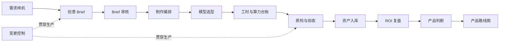

# Yunsheng AIGC Video CMS Skills

一套面向 AIGC 视频生产团队的中文 Codex Skills，把零散需求、创意 Brief、生产任务、模型选择、成本、验收和资产复用串成可追溯的 CMS 工作流。

状态：`v0.1.0` · `zh-CN` · Prompt-only · 不连接生产系统

它适合品牌广告、零售 TVC、短视频和数字人内容团队，也适合正在把“靠个人经验交付”升级为“按项目、版本、证据和指标运营”的产品经理与制作负责人。

## 解决什么问题

AIGC 视频生产的主要瓶颈通常不只是生成模型，而是以下环节无法稳定衔接：

- 群聊与会议中的需求没有形成可确认的输入基线；
- Brief、脚本、分镜和成片版本很多，却无法还原真实修改轮次；
- 模型选择依赖印象，缺少镜头级质量、稳定性、成本和时延依据；
- 工时、协作时间、API/GPU 成本和一次性建设投入混在一起；
- “文件已收到”“技术检测通过”和“需求方正式验收”被误认为同一件事；
- 项目结束后，Prompt、角色、场景和模型配置没有形成可复用资产；
- 降本、提效和 ROI 缺少周期、范围、公式与证据，难以复盘或用于履历。

本仓库通过 12 个相互独立、可以组合调用的 Skill 处理这些问题。

## 工作流



## 12 个 Skill

| Skill | 用途 | 典型输出 |
|---|---|---|
| `yunsheng-demand-gate` | 从群聊、邮件和纪要收口需求 | RequestCard、证据索引、缺口、是否可进入 Brief |
| `yunsheng-creative-brief` | 把已确认需求转成可审核创意方向 | BriefCandidate、范围、成功标准、风险 |
| `yunsheng-brief-review` | 记录真实需求方审核事件 | Approved / Needs Changes、修改项、批准基线 |
| `yunsheng-change-control` | 管理范围、创意、规格与模型变更 | VersionDiff、影响评估、批准链 |
| `yunsheng-production-orchestrator` | 编排项目、阶段、任务和人工门禁 | WBS/DAG、Owner、状态事件、依赖 |
| `yunsheng-model-decision` | 做镜头级模型路由与 POC | ModelEvalCard、推荐路径、回退方案 |
| `yunsheng-cost-ledger` | 核算工时、协作与算力成本 | CostEntry、阶段成本、单位成本 |
| `yunsheng-acceptance` | 执行内容、品牌、技术与权利质检 | QC 明细、AcceptanceRecord 候选 |
| `yunsheng-asset-registry` | 沉淀资产及生成血缘 | AssetCard、Lineage、ReusePolicy |
| `yunsheng-roi-review` | 复盘降本、提效与投入产出 | Claim 表、基线、净收益、证据覆盖 |
| `yunsheng-product-review` | 判断应自动化、模板化还是保留人工 | 指标树、选项比较、最小验证 |
| `yunsheng-roadmap` | 把已验证判断转成季度规划 | Now / Next / Later、决策门、非目标 |

完整调用关系见 [`CATALOG.md`](CATALOG.md)。

## 核心设计：事实先于漂亮数字

所有 Skill 共享一套事实契约：

- 缺失值不自动等于 `0`，也不等于失败；
- 事实、公式推算、带假设估算和外部市场基准分开记录；
- 数字必须带周期、范围、分子、分母、公式和来源；
- 文件版本数不能直接当成需求方修改轮次；
- 内部 QC、交付动作和需求方正式验收是不同事件；
- 交付金额、收入、外采报价、实际成本和节省金额不得互换；
- Skill 只生成可审阅候选，不替代具名人员作出批准或验收决定。

这些是本包提供的默认参考约定，不是任何企业的官方制度、财务政策或行业标准。采用方应按自己的组织权限、法务要求和财务口径调整。

详细口径见 [`shared/truth-contract.md`](shared/truth-contract.md) 和 [`shared/cms-metrics-dictionary.md`](shared/cms-metrics-dictionary.md)。

## 安装

克隆仓库：

```bash
git clone https://github.com/kiki-lgtm-dot/yunsheng-aigc-video-cms-skills.git
cd yunsheng-aigc-video-cms-skills
```

把需要的 Skill 目录复制到本地 Codex Skills 目录。例如：

```bash
mkdir -p ~/.codex/skills
cp -R skills/yunsheng-demand-gate ~/.codex/skills/
cp -R skills/yunsheng-creative-brief ~/.codex/skills/
```

也可以复制 `skills/` 下的全部 12 个目录。每个目录都包含独立的 `SKILL.md` 和可选 UI 元数据，不依赖本仓库其他 Skill 才能运行。安装后请在新的 Codex 回合中调用。

## 最小使用示例

先从聊天内容形成需求卡：

```text
$yunsheng-demand-gate
请处理下面这段完全合成的需求，输出来源索引、RequestCard、阻塞项和 Ready for Brief 判定；
不要补写预算、版权状态或决策人。

source_id: demo-msg-001
时间：2026-09-10 10:00
角色：需求发起人
内容：面向首次使用者制作一支 15 秒、9:16 的产品功能视频，
9 月 30 日前交付。最终拍板人尚未确定，音乐版权也未确认。
```

预期要点：`Ready for Brief: No`；最终决策人和音乐版权属于阻塞项；缺失预算不能写成 `0`；输出仍是 Draft，不产生批准或外发状态。

需求确认后生成 Brief：

```text
$yunsheng-creative-brief
基于已确认的 RequestCard 生成一版可供需求方审核的 AIGC 视频 Brief。
```

季度复盘时核算 ROI：

```text
$yunsheng-roi-review
请按 2026Q1 统计交付量、验收量、实际成本、可比外采基线和净收益；缺失项不要补 0。
```

## 从哪里来

这套 Skill 有两类来源：

1. **业务实践**：源于“云生”在 AIGC 视频项目中的产品化探索，重点处理大型零售广告与 TVC 生产中的需求收口、版本审核、项目协作、模型路由、成本核算、验收和资产沉淀。
2. **公开研究启发**：功能规划阶段研究了 [Dean Peters 的 Product Manager Skills](https://github.com/deanpeters/Product-Manager-Skills)，借鉴的是“把产品经理工作拆成可调用能力”的任务分类思路。

本仓库为独立实现。根据当前来源审计，未发现仓库包含上游的 `SKILL.md`、模板、示例或逐句翻译，也不依赖上游仓库运行。这一说明用于记录研究背景，不构成法律意义上的 clean-room 认证。上游项目采用 CC BY-NC-SA 4.0；更完整的来源与边界说明见 [`ATTRIBUTION.md`](ATTRIBUTION.md)。

“云生”是独立项目名称。本仓库不是任何雇主、客户、模型厂商或上游作者的官方项目，也不代表其背书。

## 验证与状态

- 当前版本：`0.1.0`
- 运行时依赖：无；本地包级校验需要 Python 3.10 或更高版本；
- 12/12 Skill 已通过 Codex `quick_validate.py` 结构校验；
- `python3 evals/validate_pack.py` 可检查清单、元数据、文件大小与 JSONL；
- 行为测试覆盖虚构数据、修改轮次、验收门禁、成本缺失和提示注入；
- [`evals/forward-test-report-2026-09-13.md`](evals/forward-test-report-2026-09-13.md) 中的材料均为合成数据。

本仓库提供的是工作流与判断规则，不包含视频生成模型、企业账号连接器、自动数据库写入或现成的生产系统集成。

## 贡献

欢迎提交 Issue 或 Pull Request。新增或修改 Skill 时，请同时更新 `manifest.json`，运行包级校验，并为会影响事实、成本或审批结论的行为补充测试。具体见 [`CONTRIBUTING.md`](CONTRIBUTING.md)。

## 许可证

本仓库有权授权的原创内容采用 [Apache License 2.0](LICENSE)。外部项目及链接内容仍分别适用其自身许可证。
